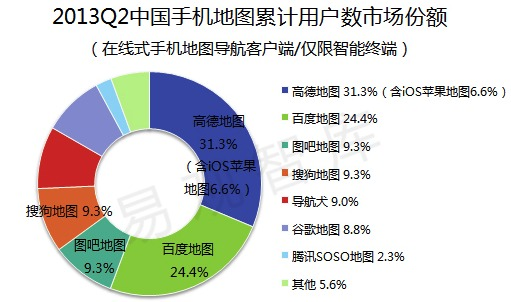

# 对高德，阿里为何非得全资收购？

**创建时间：**
_2015/1/15 9:43_

  



# 对高德，阿里为何非得全资收购？

[36kr.com](http://36kr.com)

_本文来自36氪特约作者赵楠（个人微信号：zhaonan；自媒体公众号：村里那点儿事）_

阿里计划以10.45亿美元现金收购高德软件余下72%的股份。2013年5月，阿里以2.94亿美元[收购高德软件约28%的股份](http://www.36k
r.com/p/203165.html)。

两次交易，阿里巴巴对高德软件的估值定价从去年5月的10.5亿美元，抬高到14.5亿美元。也就是说，9个月时间里，阿里对高德的估值定价涨了38%。

而在这9个月中，高德的业绩并没有反应出相应的增长比例。此外，高德地图在国内的市场份额也没有增长，而这恰是阿里巴巴较为看重的部分。据易观数据，2013年Q2，
高德地图的份额为31.3%、百度为24.4%（腾讯第7，为2.3%）；而2013年Q3，高德为31.3%、百度为26.6%。如此来看，阿里对高德的最新估值，
是比较厚道的。

本次交易阿里巴巴全部采用现金支付，而没有股权兑换。从财务上看，这也是建立在帮助高德“私有化”的方案基础之上。而一旦涉及股权交换，一是有反向上市的嫌疑；二是阿
里自身的股权将被稀释，股权结构的改变也将影响阿里在香港的上市，而阿里持有约50亿美元的现金，现金流充沛，可以看到，阿里近来的收购很少采用换股行为；三是，全部
采用现金收购，实则是帮助高德“私有化”，而阿里与高德的进一步整合，也需要高德在“私有化”的条件下以便更无顾虑的操作。

此外，截至2013年Q3，高德有高达5.1亿美金的现金流及其等价物。也就是说，理论上，阿里需要付出的现金只是5.35亿美元。

**在2013年5月的交易中，阿里巴巴已取得对高德的绝对控股权。那为何还要进一步全资收购呢？**

**一是，高德在二级市场的价格并不高，收购成本不大。**在阿里没有宣布计划收购前，高德的市盈率只有14倍左右，平均市值也就10-11亿美元。此外，账上还有5.1亿美元的现金。

**二是，如果要与阿里进一步深度的整合，在目前二级市场价格不高的情况下，高德最好的选择就是“私有化”。**在2013年Q3，随着与百度在互联网地图业务上的竞争加剧，高德的费用已大笔提升，并导致该季度出现了亏损。

财报显示，2013年Q3，高德净亏损达670万美元，而2012年Q3为净利润1010万美元，2013年Q2的净利润也有380万美元。此外，高德的市场费用同比
增长超过1.5倍，环比增长超过75%。研发费用也同比增长82%，环比增长37%。而总收入却同比、环比纷纷下滑。

也就是说，高德地图在转型的过程中，与阿里进一步整合的过程中，财报肯定会不太好看，那还不如退市，不去背财报的包袱。如果两三年后，高德地图业务发展顺利，依然存在
分拆上市，待价重估的可能。比如阿里的万网。当然，这也要看阿里的意思。

**三是，**既然高德的移动互联网业务对阿里具有直接的战略意义，该业务在高德的营收比重中占39%，那为什么不采取分拆高德移动互联网业务的方式来卖给阿里呢？不考虑资本因素，从纯业务角度去看，“不同业务线的运作都是基于数据库，而数据库无法拆分，这决定了公司整体的价值。”这句话是高德CFO张勤在去年的采访中讲过的话。

**此外，地图的底层数据库资源，在未来的互联网巨头竞争中将扮演越来越重要的地位。**虽然在O2O的竞争初期，也就是目前阶段，更多能看到的只是地图表层的POI竞争和用户竞争。

除阿里巴巴之外，目前采用高德地图底层数据库资源的互联网公司包括腾讯、360、UC以及谷歌等。可以看到的是，为了分摊风险，腾讯除了与高德合作外，也与四维有合作
关系，并也在寻觅一些地图产业链上游的收购对象。而百度和四维的合作关系则更为紧密。

**四是，**阿里正在寻找承载本地生活服务和出行服务的入口，如果这个入口是地图，那么这个核心业务一定不能是自己的“干儿子”，而必须得是“亲儿子”，这样对阿里来说才战略上安全。现在，阿里在做的正是把高德从“干儿子”变成“亲儿子”。

地图的底层数据库是互联网巨头的战略储备资源，而更外一层的互联网地图则是O2O的搜索入口。相比PC的搜索入口，基于手机端的搜索入口更强调用户体验的完整性，也就
是说，你不但要给我一个框，还要给我优质的内容，并且要让我感觉到从框的搜索到内容的服务体验上更加无缝。因此，基于地图端搭建一个完整的生态服务链条，非常重要。

而对于地图这个框来说，内容是什么？就是POI服务。可以看到的是，阿里、百度和腾讯，正在疯狂的对POI服务进行收购。比如，[百度全资收购糯米网](http:/
/www.36kr.com/p/209386.html)，与百度地图整合。腾讯和阿里，分别对[嘀嘀](http://www.36kr.com/p/21076
5.html)和[快的打车](http://www.36kr.com/p/210871.html)进行战略投资。此外，阿里的生态里，还不乏美团、聚划算、在路
上这种基于地理信息位置的移动服务。

那么，如何从地图这个框的搜索到内容的服务上更加无缝？这个中间环节除了基于产品接口的数据深度对接外，就是支付体系的完善。阿里有支付宝，腾讯有微信支付，这些都将
与地图业务进行深度整合。

也由此看出，百度也一定会发力自身的支付业务。如果自己来不及打造一个支付体系，百度也许会通过收购来布局。

也就是说，地图业务只是O2O的承载平台，只是O2O战略的一个开始。往后更重要的是生态的融合。**所缺的生态资源，就去收购；已有的生态资源，就看如何与地图业务
进行无缝整合。**

**地图业务依然是BAT之间的三国大战。**尽管腾讯地图的市场份额在2013年Q2仅有2.3%，排在第七位。但只要腾讯高层愿意发力，凭借腾讯的渠道分发能力、腾讯的O2O生态资源，以及腾讯的资本并购能力，依然能够快速托起它的地图业务。

**但还有两个搅局变量，就是雷军的小米，以及周鸿祎的360。**

阿里对高德的全资收购，会引发怎样的连锁反应？

在国内互联网地图市场，图吧、搜狗、谷歌地图都拥有约9%的市场份额，差距比较接近，紧随高德与百度。谷歌地图外，搜狗已有主，具有被收购价值的就是图吧。而图吧的股
东是IDG和陈一舟的人人。图吧是否会成为腾讯的猎物呢？

此外，阿里巴巴已经全资收购了高德，那么它还会有足够的精力竞逐大众点评么？大众点评是独立上市，还是栖身腾讯，也很难说。

Original Page: <http://www.36kr.com/p/211127.html>



